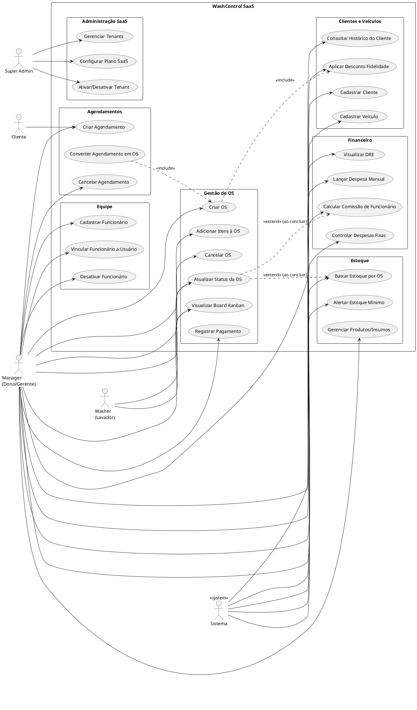
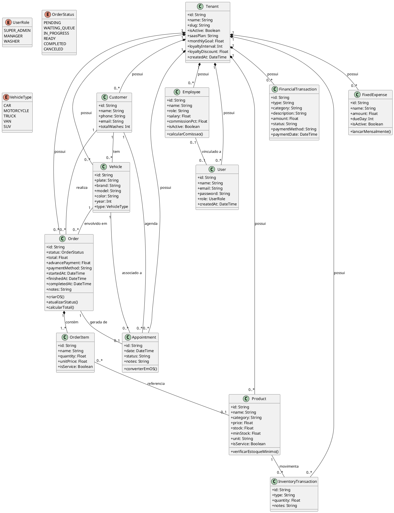
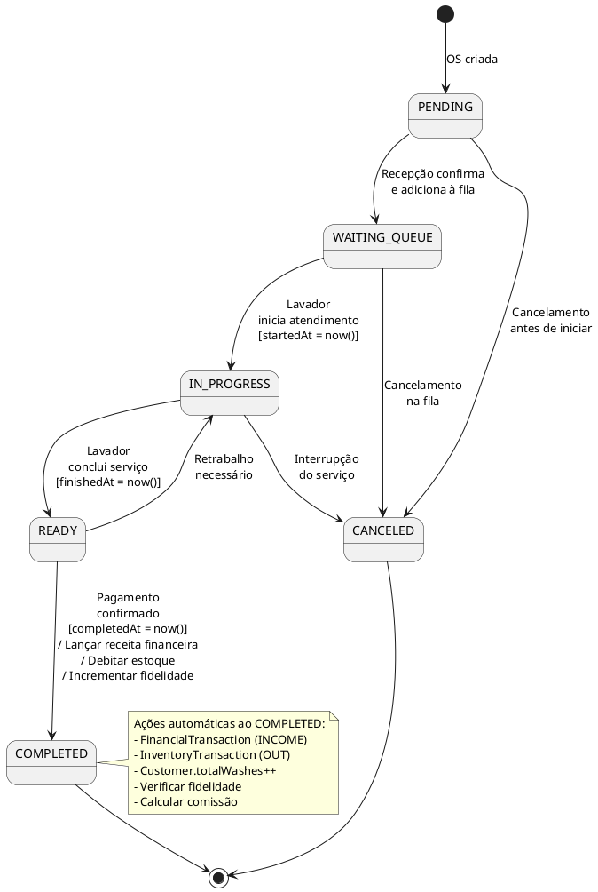
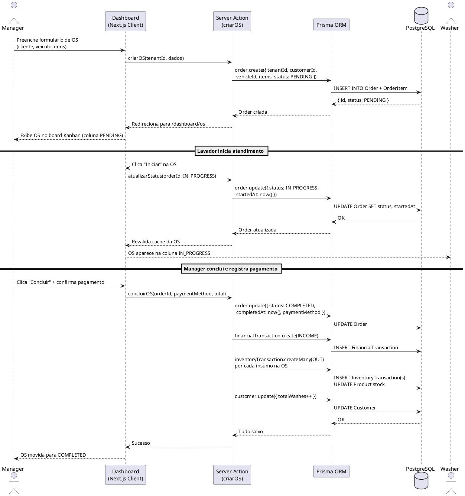
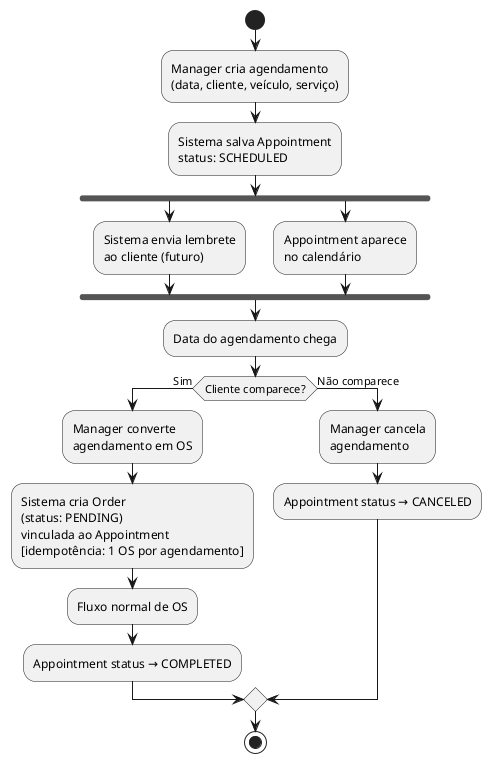
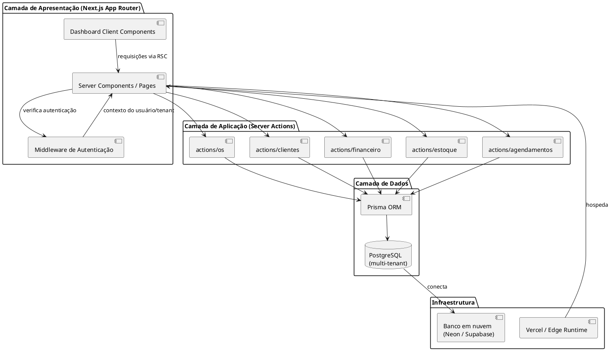

# Contexto Acadêmico — WashControl
## Matéria: Modelagem de Sistemas

---

## 1. Descrição do Sistema

O **WashControl** é um SaaS (Software as a Service) multi-tenant para gestão operacional e financeira de lava-cars. Cada lava-car cadastrado é um **tenant** isolado, com seus próprios clientes, veículos, funcionários, ordens de serviço e dados financeiros. A plataforma é gerenciada centralmente por um Super Admin.

**Nome do sistema:** WashControl  
**Domínio:** Gestão de lava-cars  
**Arquitetura:** SaaS multi-tenant, web-based  
**Stack:** Next.js 15, TypeScript, Prisma ORM, PostgreSQL

---

## 2. Stakeholders

### 2.1 Stakeholders Primários (usuários diretos)

| Stakeholder | Papel | Interesse | Influência | Impacto |
|---|---|---|---|---|
| **Dono do Lava-Car (Manager)** | Gerencia o negócio | Controle financeiro, relatórios, gestão de equipe e clientes | Alta | Alta |
| **Lavador (Washer)** | Executa os serviços | Visualizar OS atribuídas, atualizar status, ver pátio | Baixa | Alta |
| **Cliente do Lava-Car** | Utiliza o serviço | Agendamento, histórico, programa de fidelidade | Média | Alta |
| **Super Admin** | Administra a plataforma | Gestão de tenants, planos SaaS, faturamento | Alta | Alta |

### 2.2 Stakeholders Secundários (interessados indiretos)

| Stakeholder | Interesse |
|---|---|
| **Investidor/Sócio** | Receita do SaaS, crescimento de tenants |
| **Contador do Lava-Car** | Exportação de dados financeiros, DRE |
| **Fornecedores de Insumos** | Integração futura de pedidos automáticos |

---

## 3. Técnicas de Elicitação de Requisitos

As técnicas de elicitação são ferramentas utilizadas pelo Analista de Requisitos para descobrir e compreender os requisitos do sistema (Reinehr). Para o WashControl, as técnicas foram selecionadas com base nas características de cada stakeholder, na natureza das informações necessárias e no escopo do projeto.

> **Princípio:** Na fase de elicitação nunca se utiliza apenas uma técnica, mas todas as que forem necessárias ou apropriadas para cada caso.

### 3.1 Visão Geral — Mapeamento Técnica × Stakeholder

| Técnica | Stakeholder-alvo | Justificativa ("quando usar") | RFs/RNFs resultantes |
|---|---|---|---|
| **Entrevista** | Manager (Dono do Lava-Car) | Captura de informações subjetivas sobre dores e fluxo de trabalho; identificação do fluxo de documentos (OS, pagamentos) | RF02, RF03, RF05, RF07, RF08, RF10 |
| **Observação** | Washer (Lavador) no pátio | Fluxo físico de trabalho é relevante; problemas de performance ligados à forma de executar; influência real do ambiente (pátio externo, celular na mão) | RF03, RF04, RNF01, RNF03 |
| **Questionário** | Múltiplos donos de lava-car (validação de mercado) | Usuários em pontos geográficos distantes; dados tratáveis estatisticamente para validar o produto SaaS | RF01, RF09, RF10 |
| **Brainstorming** | Equipe de desenvolvimento + stakeholders-chave | Lançamento de novo produto no mercado; busca de soluções inovadoras (fidelidade, notificações) | RF09, RF08 (comissões), planos SaaS |
| **JAD** | Todos os stakeholders principais | Escopo grande (10+ módulos); grande abrangência de áreas; busca de decisões consensuais sobre arquitetura multi-tenant | Baseline RF01–RF10 + arquitetura |

---

### 3.2 Entrevista — Manager (Dono do Lava-Car)

**Definição (Reinehr):** Conversa entre duas pessoas, provocada por uma delas, com objetivo definido. Proporciona o contato pessoal que faz com que o entrevistado se sinta parte influente do processo.

**Quando foi usada:** Para captar as informações subjetivas e identificar o fluxo real de trabalho e documentos — critérios exatos descritos na técnica.

**Preparação aplicada:**
- Ordem lógica das questões (do geral para o específico)
- Apenas um tópico por questão
- Roteiro pessoal com objetivos mínimos

**Roteiro aplicado:**
1. Como funciona o processo de entrada de um veículo hoje?
2. Como você controla os pagamentos e despesas atualmente?
3. Como você sabe quais funcionários rendem mais?
4. Você já perdeu clientes por falta de comunicação?
5. O que mais te faz perder tempo no dia a dia?

**Informações obtidas:**
- Fluxo atual: cliente chega → recepção anota em papel → lavador pega o carro → dono confere manualmente ao final
- Principal dor: sem controle financeiro claro (DRE feito em planilha ou no "feeling")
- Desejo implícito: saber em tempo real o que acontece no pátio

**Limitações encontradas:**
- Tendência a idealizar o processo ("aqui é organizado") em vez de descrever a realidade
- Necessidade de reconduções frequentes para retornar ao foco

**RFs resultantes:** RF02 (clientes/veículos), RF03 (Kanban OS), RF07 (financeiro automático), RF08 (despesas fixas), RF10 (relatórios)

---

### 3.3 Observação — Pátio de Lavagem (Washer)

**Definição (Reinehr):** Técnica que utiliza os sentidos na obtenção de determinados aspectos da realidade; não consiste apenas em ver e ouvir, mas em examinar fatos que se deseja estudar.

**Quando foi usada:** O fluxo físico do pátio é relevante; os problemas de performance estão diretamente ligados à forma de executar o trabalho; a influência real do ambiente (área externa, sol, mãos molhadas) é importante.

**Recomendações seguidas:**
- Observação em período de serviço normal (sem interferência)
- Observador não interferiu no trabalho
- Verificação se procedimentos manuais existentes refletiam a realidade

**Constatações-chave no pátio:**
- Lavadores não ficam em frente ao computador; operam com celular ou tablet
- Fluxo físico: veículo entra → lavador verifica o que fazer → começa → termina → avisa recepção verbalmente
- Pilhas de papéis e anotações manuais identificadas na recepção
- Conflito de atribuição: dois lavadores pegaram o mesmo carro por falta de sistema

**Impacto nos requisitos:**
- RNF01: Interface obrigatoriamente responsiva (tela de celular no pátio)
- RF04: View simplificada para o Washer (pátio visual)
- RF03: Status WAITING_QUEUE criado para eliminar conflito de atribuição
- RNF03: Atualização de status deve ser imediata (≤ 2 segundos) para o pátio funcionar

**Limitações encontradas:**
- A presença do observador provocou comportamento mais organizado que o habitual

---

### 3.4 Questionário — Validação do Produto SaaS

**Definição (Reinehr):** Conjunto de perguntas com respostas objetivas ou graduais, dispostas em sequência lógica e progressiva, aplicado a uma ou mais pessoas.

**Quando foi usado:** Múltiplos donos de lava-car em cidades distintas; necessidade de dados estatísticos para validar o modelo SaaS antes do desenvolvimento.

**Perguntas aplicadas:**

| # | Pergunta | Tipo de resposta |
|---|---|---|
| 1 | Você usa alguma ferramenta digital para controlar clientes? | Sim/Não + qual |
| 2 | Qual funcionalidade é mais importante? | Escala 1–5 por módulo |
| 3 | Você notificaria clientes automaticamente sobre o status do veículo? | Sim/Não/Talvez |
| 4 | Teria interesse em sistema por assinatura mensal? | Sim/Não + valor aceitável |

**Resultado estatístico:**
- 78% não usam nenhum sistema digital
- RF09 (notificações) e RF10 (relatórios) eleitos como funcionalidades mais desejadas
- Validação da estratégia de planos SaaS: BASIC, PRO, ENTERPRISE

**Limitações encontradas:**
- Respostas distorcidas por desconhecimento do que um sistema poderia fazer
- Questionário frio: não capturou dores emocionais que a entrevista revelou

---

### 3.5 Brainstorming — Sessão de Ideação do Produto

**Definição (Reinehr):** "Tempestade" de ideias, sem julgamentos ou análises, em ambiente descontraído e informal. Ideal para buscar ideias de novos produtos.

**Quando foi usado:** Lançamento de novo produto no mercado (SaaS); busca de soluções inovadoras para diferenciação.

**Participantes:** Equipe de desenvolvimento (3 pessoas) + 2 donos de lava-car + 1 investidor.

**Preparação:**
- Dinâmica de grupo inicial para descontração
- Flipchart para registro rápido de ideias
- Regra: nenhuma crítica durante a geração de ideias

**Ideias geradas e status:**

| Ideia | Status |
|---|---|
| Programa de fidelidade automático por contagem de lavagens | Implementado (`Customer.totalWashes`, `Tenant.loyaltyInterval`) |
| Pátio visual em tempo real estilo Kanban | Implementado (módulo `/os` + `/patio`) |
| Notificação via WhatsApp quando OS fica READY | Planejado (RF09) |
| Multi-tenant com slug único por loja | Implementado (`Tenant.slug`) |
| Planos SaaS com funcionalidades diferenciadas | Implementado (BASIC/PRO/ENTERPRISE) |

---

### 3.6 Sessão JAD — Design Completo do Sistema

**Definição (Reinehr):** "Método destinado a extrair informações de alta qualidade dos usuários em curto espaço de tempo, através de reuniões estruturadas que buscam decisões por consenso."

**Quando foi usado:**
- Escopo grande: 10+ módulos (OS, financeiro, estoque, agendamentos, equipe, faturamento, pátio, configurações)
- Grande abrangência de áreas: operacional + financeiro + notificações + SaaS B2B
- Necessidade de decisões consensuais sobre multi-tenancy e papéis de acesso

**Participantes da sessão JAD:**

| Papel JAD | Quem | Responsabilidade |
|---|---|---|
| **Condutor (Líder)** | Analista de Requisitos (imparcial) | Garante participação igualitária; não emite opinião técnica; resolve conflitos |
| **Analista de Sistemas** | Desenvolvedor WashControl | Levanta dados, prepara material de apoio, escreve documentação final |
| **Executivo Patrocinador** | Dono do projeto / investidor | Autoridade sobre decisões; define objetivos estratégicos; resolve impasses |
| **Usuário — Manager** | Dono do lava-car | Informa necessidades operacionais e financeiras do negócio |
| **Usuário — Washer** | Lavador de veículos | Informa necessidades do pátio e usabilidade móvel |
| **Documentador** | Membro da equipe | Registra todas as decisões e produz a ata da sessão |
| **Ouvinte** | Aluno de Modelagem de Sistemas | Aprende a técnica e o domínio do negócio |

**Fase 1 — Preparação:**
- Avaliação: JAD é adequado pelo escopo grande e múltiplas áreas envolvidas
- Definição de escopo: SaaS multi-tenant para lava-cars e estéticas automotivas
- Familiarização com jargões: OS, pátio, insumos, comissão, fidelidade (glossário criado)
- Agenda preparada com antecedência e distribuída aos participantes
- Ambiente: sala com mesas em "U", flipchart, notebooks para documentação

**Fase 2 — Execução:**
- Apresentação de cada módulo pelo Analista; discussão e votação consensual
- Conflitos resolvidos:
  - *Quem pode cancelar uma OS?* → Decisão: apenas MANAGER (não WASHER)
  - *Quando debitar o estoque?* → Decisão: somente ao COMPLETED, não durante a execução
  - *WASHER vê dados financeiros?* → Decisão: não; apenas dados operacionais (RNF05)
- Documentador registrou todas as decisões em tempo real

**Fase 3 — Revisão:**
- Documentação consolidada no arquivo `contexto.md`
- Validação com todos os participantes via e-mail
- Pasta do projeto organizada com todos os artefatos (schema.prisma, diagramas, RFs)

**Decisões consensuais obtidas na sessão:**

| Decisão | Impacto |
|---|---|
| WASHER sem acesso financeiro/estoque | RNF05 |
| 1 agendamento = no máximo 1 OS | RF05 + RN-03 (idempotência) |
| Estoque debita só no COMPLETED | RN-05 |
| Interface web-first, responsiva | RNF01, RNF07 |
| Isolamento total de dados por tenant | RNF02, RN-09 |

---

## 4. Requisitos Funcionais

> Requisitos levantados no documento oficial da disciplina de Modelagem de Sistemas.

| ID | Descrição | Requisitante | Detalhes |
|---|---|---|---|
| RF01 | O sistema deve permitir o cadastro e gerenciamento de Tenants (lava-jatos parceiros). | SUPER_ADMIN | Envolve a criação da conta principal da loja no modelo SaaS. |
| RF02 | O sistema deve permitir o cadastro de clientes e seus respectivos veículos. | MANAGER | Deve suportar a vinculação de múltiplos veículos a um único Customer. |
| RF03 | O sistema deve gerenciar o ciclo de vida da Ordem de Serviço (OS) através de um Kanban. | MANAGER | A OS deve transitar pelos status: PENDING, WAITING_QUEUE, IN_PROGRESS, READY, COMPLETED ou CANCELED. |
| RF04 | O sistema deve permitir a visualização e atualização de status das OSs ativas no pátio. | WASHER | Interface simplificada para que o lavador mova o card da OS (ex: de WAITING_QUEUE para IN_PROGRESS). |
| RF05 | O sistema deve permitir o agendamento prévio (Appointment) de serviços de lavagem. | Customer / MANAGER | O cliente final ou o gerente podem reservar um horário na agenda. |
| RF06 | O sistema deve abater automaticamente produtos do estoque (InventoryTransaction) ao adicionar itens (OrderItem) na OS. | MANAGER | Integração entre a conclusão da OS e a baixa dos insumos utilizados. |
| RF07 | O sistema deve gerar uma transação financeira de receita (FinancialTransaction) ao concluir uma OS. | MANAGER | O fechamento da OS no Kanban engatilha o registro financeiro automático. |
| RF08 | O sistema deve permitir o registro e controle de despesas fixas (FixedExpense) e pagamentos de funcionários. | MANAGER | Controle de custos operacionais como água, luz, aluguel e comissões. |
| RF09 | O sistema deve disparar notificações sobre a mudança de status do veículo. | Customer | O cliente deve ser avisado (ex: via WhatsApp ou Push) quando o status mudar para READY. |
| RF10 | O sistema deve prover relatórios gerenciais sobre o volume de OSs, receitas e despesas. | MANAGER | Dashboard unificando os dados financeiros e operacionais do Tenant. |

---

## 5. Requisitos Não Funcionais (Classificação FURPS+)

> Classificação segundo o modelo FURPS+ (Functionality, Usability, Reliability, Performance, Supportability + restrições).

| ID | Descrição | Requisitante | Categoria FURPS+ | Detalhes |
|---|---|---|---|---|
| RNF01 | O sistema deve possuir uma interface responsiva para adaptação a telas de smartphones. | WASHER | **Usability** (Usabilidade) | Essencial para o uso do sistema no pátio do lava-jato via celular. |
| RNF02 | O sistema deve garantir o isolamento lógico dos dados entre diferentes lojas. | SUPER_ADMIN | **Reliability** (Confiabilidade) | Sendo multi-tenant, um gerente nunca pode acessar dados (clientes, OS) de outro tenant. |
| RNF03 | A atualização de status da OS no painel Kanban deve ser refletida na interface em no máximo 2 segundos. | MANAGER | **Performance** (Desempenho) | O tempo de resposta deve garantir a fluidez da operação no pátio. |
| RNF04 | O sistema deve utilizar o padrão Repository com ORM (Prisma) para o acesso a dados. | Equipe de Desenvolvimento | **Supportability** (Suportabilidade) | Facilita a manutenção do código, trocas de SGBD e escalabilidade. |
| RNF05 | O sistema deve restringir o acesso a funcionalidades financeiras e de estoque exclusivamente ao papel de gerência. | MANAGER | **+ Security** (Segurança) | O WASHER só tem acesso operacional, enquanto o MANAGER tem acesso total à sua loja. |
| RNF06 | O modelo de dados central do sistema deve ser armazenado em um banco de dados relacional. | Equipe de Arquitetura | **+ Implementation** (Implementação) | Restrição tecnológica atendida pelo uso do schema.prisma (ex: PostgreSQL). |

---

## 6. Diagrama de Casos de Uso (PlantUML)



---

## 7. Diagrama de Classes (PlantUML)



---

## 8. Diagrama de Estado — Ciclo de Vida da OS (PlantUML)



---

## 9. Diagrama de Sequência — Criar e Concluir OS (PlantUML)



---

## 10. Diagrama de Atividade — Fluxo de Agendamento (PlantUML)



---

## 11. Diagrama de Componentes (PlantUML)



---

## 12. Modelo Entidade-Relacionamento (Resumido)

```
TENANT ||--o{ USER : "possui"
TENANT ||--o{ CUSTOMER : "possui"
TENANT ||--o{ VEHICLE : "possui"
TENANT ||--o{ ORDER : "possui"
TENANT ||--o{ PRODUCT : "possui"
TENANT ||--o{ EMPLOYEE : "possui"
TENANT ||--o{ APPOINTMENT : "possui"
TENANT ||--o{ FINANCIAL_TRANSACTION : "possui"
TENANT ||--o{ INVENTORY_TRANSACTION : "possui"
TENANT ||--o{ FIXED_EXPENSE : "possui"

CUSTOMER ||--o{ VEHICLE : "tem"
CUSTOMER ||--o{ ORDER : "realiza"
CUSTOMER ||--o{ APPOINTMENT : "agenda"

VEHICLE ||--o{ ORDER : "envolvido em"
VEHICLE ||--o{ APPOINTMENT : "associado a"

ORDER ||--|{ ORDER_ITEM : "contém"
ORDER |o--|| APPOINTMENT : "gerada de"

ORDER_ITEM }o--o| PRODUCT : "referencia"
PRODUCT ||--o{ INVENTORY_TRANSACTION : "movimenta"

EMPLOYEE |o--o| USER : "vinculado a"
```

---

## 13. Regras de Negócio

| ID | Regra | Origem |
|---|---|---|
| RN-01 | Uma OS deve ter pelo menos 1 item (serviço ou insumo) | Modelo de negócio |
| RN-02 | A placa de veículo é única dentro de um tenant | schema.prisma `@@unique([tenantId, plate])` |
| RN-03 | Um agendamento pode gerar no máximo 1 OS (idempotência) | `Appointment.orderId @unique` |
| RN-04 | O contador de fidelidade incrementa apenas em OS com status COMPLETED | RF-08 |
| RN-05 | O estoque só é debitado quando a OS é COMPLETED (não em IN_PROGRESS) | RF-20 |
| RN-06 | A comissão do funcionário é calculada sobre o total da OS concluída | Employee.commissionPct |
| RN-07 | Despesas fixas são lançadas automaticamente no dia configurado (dueDay) | FixedExpense.dueDay |
| RN-08 | O desconto de fidelidade é aplicado quando `totalWashes % loyaltyInterval == 0` | Tenant.loyaltyInterval |
| RN-09 | Dados de um tenant nunca são visíveis para outro tenant | RNF-01, tenantId em toda query |
| RN-10 | Super Admin não pertence a nenhum tenant (`tenantId` nullable em User) | schema.prisma |

---

## 14. Glossário do Domínio

| Termo | Definição |
|---|---|
| **Tenant** | Empresa lava-car cadastrada na plataforma WashControl |
| **OS (Ordem de Serviço)** | Registro de um atendimento a um veículo, com itens, status e financeiro |
| **OrderItem** | Item dentro de uma OS: pode ser serviço (mão de obra) ou insumo físico |
| **Insumo** | Produto físico consumido durante a lavagem (shampoo, cera, etc.) |
| **Pátio** | Área visual que mostra todos os veículos em atendimento no momento |
| **Fidelidade** | Programa que concede desconto automático a cada N lavagens concluídas |
| **SaaS Plan** | Plano de assinatura do tenant: BASIC, PRO ou ENTERPRISE |
| **Tenant Slug** | Identificador único da URL do lava-car (ex: `lavajato-centro`) |
| **Super Admin** | Administrador da plataforma que gerencia todos os tenants |
| **Comissão** | Percentual do valor da OS pago ao funcionário que realizou o serviço |
