# Curso de Bacharelado em Ciência da Computação — BCC
## Modelagem de Sistemas Computacionais

**Projeto:** Análise e Projeto de Sistema Computacional

**Contexto:** WashControl — Sistema SaaS de Gestão para Lava-Cars e Estéticas Automotivas

**Condução:** Leonardo dos Santos Marques

**Objetivo:** Especificar o sistema WashControl aplicando UML para um problema de contexto real no mercado de estética automotiva.

---

# RA1 — Modelo de Domínio

## 1. Introdução

### 1.1 Contexto de Negócio

O mercado de cuidados automotivos — popularmente chamado de *detailing* — tem crescido de forma expressiva no Brasil. As pessoas investem cada vez mais em seus veículos e buscam serviços de qualidade. No entanto, a maioria dos estabelecimentos de pequeno e médio porte ainda opera de forma desorganizada: filas sem controle, anotações em papel, comunicação dispersa via WhatsApp e ausência de visibilidade financeira.

O **WashControl** é um sistema SaaS (*Software as a Service*) multi-tenant desenvolvido para atender lava-cars e estéticas automotivas. Cada estabelecimento cadastrado na plataforma é tratado como um *tenant* isolado, com seus próprios clientes, veículos, funcionários, ordens de serviço e dados financeiros. A plataforma é administrada centralmente por um Super Admin, que gerencia os tenants, planos de assinatura e faturamento.

A arquitetura multi-tenant permite que o WashControl atenda simultaneamente dezenas de estabelecimentos com um único sistema, reduzindo custos de infraestrutura e facilitando a escalabilidade do produto.

### 1.2 Justificativa do Projeto

O principal problema que o WashControl resolve é a **falta de previsibilidade e controle** nos lava-cars. Quando um cliente deixa o veículo e recebe a informação "volta em 2 horas", mas ao chegar o serviço nem começou, a confiança é destruída. Da mesma forma, o dono do estabelecimento frequentemente não sabe com precisão quanto lucrou no dia, quais funcionários são mais produtivos ou quais insumos estão em falta.

O projeto se justifica pela necessidade de **automatizar o fluxo operacional** — desde o agendamento até a entrega do veículo — e fornecer **visibilidade financeira em tempo real** ao gestor. Estabelecimentos que utilizam sistemas organizados passam mais credibilidade ao cliente, conseguem atender maior volume de serviços sem perda de qualidade e tomam decisões baseadas em dados.

Do ponto de vista de mercado, trata-se de uma oportunidade de negócio B2B (empresa-para-empresa) com modelo de receita recorrente via assinatura (SaaS), com baixa concorrência de sistemas especializados acessíveis para pequenos e médios estabelecimentos.

### 1.3 Benefícios

**Para o dono do negócio (Manager):**
- Controle financeiro real com DRE automática (receitas × despesas)
- Visibilidade da produtividade da equipe e cálculo automático de comissões
- Gestão de estoque integrada ao fluxo de atendimento
- Programa de fidelidade configurável para reter clientes

**Para o lavador (Washer):**
- Interface simplificada e responsiva para uso no pátio via celular
- Fila de serviços organizada, eliminando conflitos de atribuição

**Para o cliente:**
- Agendamento prévio de horário
- Notificação automática quando o veículo estiver pronto (RF09)
- Histórico de atendimentos e benefícios do programa de fidelidade

**Para a operação como um todo:**
- Redução de erros humanos (dupla marcação, serviços não cobrados)
- Rastreabilidade completa do ciclo de vida de cada ordem de serviço
- Isolamento de dados entre estabelecimentos (multi-tenancy seguro)

---

## 2. Requisitos

### 2.1 Requisitos Funcionais

| ID | Descrição | Requisitante | Detalhes |
|---|---|---|---|
| RF01 | O sistema deve permitir o cadastro e gerenciamento de Tenants (lava-jatos parceiros). | SUPER_ADMIN | Envolve a criação da conta principal da loja no modelo SaaS, com nome, slug único e plano de assinatura. |
| RF02 | O sistema deve permitir o cadastro de clientes e seus respectivos veículos. | MANAGER | Deve suportar a vinculação de múltiplos veículos a um único Customer. A placa do veículo deve ser única por tenant. |
| RF03 | O sistema deve gerenciar o ciclo de vida da Ordem de Serviço (OS) através de um Kanban. | MANAGER | A OS deve transitar pelos status: PENDING, WAITING_QUEUE, IN_PROGRESS, READY, COMPLETED ou CANCELED. |
| RF04 | O sistema deve permitir a visualização e atualização de status das OSs ativas no pátio. | WASHER | Interface simplificada para que o lavador mova o card da OS (ex: de WAITING_QUEUE para IN_PROGRESS). |
| RF05 | O sistema deve permitir o agendamento prévio (Appointment) de serviços de lavagem. | Customer / MANAGER | O cliente final ou o gerente podem reservar um horário na agenda. Um agendamento pode gerar no máximo uma OS (idempotência). |
| RF06 | O sistema deve abater automaticamente produtos do estoque (InventoryTransaction) ao concluir uma OS. | MANAGER | Integração entre a conclusão da OS e a baixa dos insumos utilizados nos itens da OS. |
| RF07 | O sistema deve gerar uma transação financeira de receita (FinancialTransaction) ao concluir uma OS. | MANAGER | O fechamento da OS no Kanban engatilha o registro financeiro automático com método de pagamento e valor total. |
| RF08 | O sistema deve permitir o registro e controle de despesas fixas (FixedExpense) e pagamentos de funcionários. | MANAGER | Controle de custos operacionais como água, luz, aluguel e comissões calculadas sobre OSs concluídas. |
| RF09 | O sistema deve disparar notificações sobre a mudança de status do veículo. | Customer | O cliente deve ser avisado (ex: via WhatsApp ou Push) quando o status mudar para READY. |
| RF10 | O sistema deve prover relatórios gerenciais sobre o volume de OSs, receitas e despesas. | MANAGER | Dashboard unificando os dados financeiros e operacionais do Tenant (DRE, fluxo de caixa, KPIs). |

### 2.2 Requisitos Não Funcionais (Classificação FURPS+)

| ID | Descrição | Requisitante | Categoria FURPS+ | Detalhes |
|---|---|---|---|---|
| RNF01 | O sistema deve possuir uma interface responsiva para adaptação a telas de smartphones. | WASHER | **Usability** (Usabilidade) | Essencial para o uso do sistema no pátio do lava-jato via celular, com mãos potencialmente molhadas. |
| RNF02 | O sistema deve garantir o isolamento lógico dos dados entre diferentes lojas. | SUPER_ADMIN | **Reliability** (Confiabilidade) | Sendo multi-tenant, um gerente nunca pode acessar dados (clientes, OS) de outro tenant. O tenantId é obrigatório em todas as queries. |
| RNF03 | A atualização de status da OS no painel Kanban deve ser refletida na interface em no máximo 2 segundos. | MANAGER | **Performance** (Desempenho) | O tempo de resposta deve garantir a fluidez da operação no pátio em tempo real. |
| RNF04 | O sistema deve utilizar o padrão Repository com ORM (Prisma) para o acesso a dados. | Equipe de Desenvolvimento | **Supportability** (Suportabilidade) | Facilita a manutenção do código, trocas de SGBD e escalabilidade do sistema. |
| RNF05 | O sistema deve restringir o acesso a funcionalidades financeiras e de estoque exclusivamente ao papel de gerência. | MANAGER | **+ Security** (Segurança) | O WASHER só tem acesso operacional (pátio, OS), enquanto o MANAGER tem acesso total à sua loja. |
| RNF06 | O modelo de dados central do sistema deve ser armazenado em um banco de dados relacional. | Equipe de Arquitetura | **+ Implementation** (Implementação) | Restrição tecnológica atendida pelo uso do schema.prisma com PostgreSQL. |

---

## 3. Modelagem do Sistema

### 3.1 Diagrama de Caso de Uso

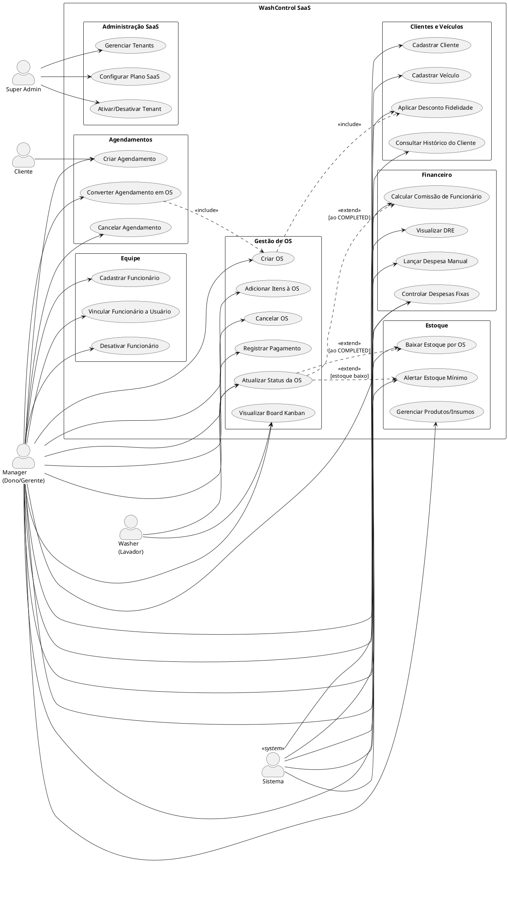

---

### 3.2 Especificações de Casos de Uso

---

#### UC-01 — Criar Ordem de Serviço

**Nome do Caso de Uso:** Criar Ordem de Serviço (OS)

**Breve Descrição:** Permite que o Manager registre a entrada de um veículo no sistema, criando uma Ordem de Serviço vinculada a um cliente, um veículo e com os itens de serviço/insumos a serem executados. A OS é criada com status PENDING e passa a compor o board Kanban.

**Ator Principal:** Manager

**Ator Secundário:** Sistema (valida dados, persiste no banco, verifica fidelidade)

**Precondições:**
- O Manager deve estar autenticado no sistema com papel MANAGER
- O cliente deve estar previamente cadastrado no sistema (ou ser cadastrado durante o fluxo)
- O veículo deve estar vinculado ao cliente
- Deve haver pelo menos um produto/serviço cadastrado no catálogo do tenant

**Pós-condições:**
- Uma nova OS é criada com status PENDING no banco de dados
- A OS aparece na coluna PENDING do board Kanban
- Os itens (OrderItems) estão vinculados à OS com preços e quantidades

**Fluxo de Eventos:**

*Fluxo Básico:*
1. O Manager acessa o módulo `/dashboard/os`
2. O Manager clica em "Nova OS"
3. O sistema exibe o formulário de criação com campos: cliente, veículo, itens, observações, pagamento antecipado
4. O Manager seleciona o cliente pelo nome ou telefone
5. O sistema lista os veículos vinculados ao cliente selecionado
6. O Manager seleciona o veículo a ser atendido
7. O Manager adiciona os itens da OS (serviços e/ou insumos) com quantidades e preços unitários
8. O sistema calcula e exibe o valor total em tempo real
9. O Manager confirma a criação clicando em "Criar OS"
10. O sistema persiste a OS com status PENDING e redireciona para o board Kanban
11. O sistema verifica se o cliente atingiu o intervalo de fidelidade (`totalWashes % loyaltyInterval == 0`) e, se aplicável, aplica desconto automaticamente

*Fluxo Alternativo — Cliente não cadastrado:*
- 4a. O Manager não encontra o cliente na busca
- 4b. O Manager clica em "Novo Cliente"
- 4c. O sistema exibe o formulário de cadastro de cliente (nome, telefone, e-mail)
- 4d. O Manager preenche e confirma o cadastro
- 4e. O fluxo retorna ao passo 5

*Fluxo Alternativo — Criação via Agendamento:*
- 1a. O Manager acessa o módulo `/dashboard/agendamentos`
- 1b. O Manager seleciona um agendamento com status SCHEDULED
- 1c. O Manager clica em "Converter em OS"
- 1d. O sistema preenche automaticamente cliente e veículo a partir do agendamento
- 1e. O fluxo continua a partir do passo 7
- **Restrição:** O sistema impede a criação de uma segunda OS para o mesmo agendamento (idempotência via `Appointment.orderId @unique`)

*Fluxo de Exceção — Veículo sem itens:*
- 9a. O Manager tenta confirmar a OS sem nenhum item adicionado
- 9b. O sistema exibe a mensagem: "A OS deve conter pelo menos um serviço ou insumo"
- 9c. O fluxo retorna ao passo 7

---

#### UC-03 — Atualizar Status da Ordem de Serviço

**Nome do Caso de Uso:** Atualizar Status da Ordem de Serviço

**Breve Descrição:** Permite que o Manager ou o Washer movam a OS entre os estados do ciclo de vida (PENDING → WAITING_QUEUE → IN_PROGRESS → READY → COMPLETED). Ao atingir o status COMPLETED, o sistema executa automaticamente os processos financeiro, de estoque e de fidelidade.

**Ator Principal:** Manager (para todos os status) / Washer (apenas IN_PROGRESS e READY)

**Ator Secundário:** Sistema (registros financeiros e de estoque automáticos)

**Precondições:**
- O usuário deve estar autenticado
- A OS deve existir e pertencer ao tenant do usuário
- A transição de status deve ser válida conforme o ciclo de vida definido

**Pós-condições:**
- O status da OS é atualizado no banco de dados
- Os campos de timestamp correspondentes são preenchidos (startedAt, finishedAt, completedAt)
- Se o novo status for COMPLETED:
  - Uma FinancialTransaction de INCOME é criada automaticamente
  - InventoryTransactions de saída (OUT) são criadas para cada insumo da OS
  - O estoque de cada produto é decrementado
  - O contador `Customer.totalWashes` é incrementado
  - A comissão do funcionário é calculada
- A interface do Kanban é atualizada em no máximo 2 segundos (RNF03)

**Fluxo de Eventos:**

*Fluxo Básico — Conclusão de OS (READY → COMPLETED):*
1. O Manager acessa o board Kanban em `/dashboard/os`
2. O Manager localiza a OS na coluna READY
3. O Manager clica no card da OS e seleciona "Concluir / Registrar Pagamento"
4. O sistema exibe o formulário de conclusão: método de pagamento, valor total, valor adiantado
5. O Manager confirma o método de pagamento (PIX, Dinheiro, Cartão Crédito, Cartão Débito)
6. O Manager clica em "Confirmar Conclusão"
7. O sistema atualiza o status para COMPLETED e registra `completedAt = now()`
8. O sistema cria automaticamente:
   - `FinancialTransaction` (type: INCOME, amount: total da OS)
   - `InventoryTransaction` OUT para cada OrderItem com `isService = false`
   - Decrementa `Product.stock` para cada insumo
9. O sistema incrementa `Customer.totalWashes`
10. O sistema verifica se o cliente atingiu o intervalo de fidelidade e aplica desconto, se aplicável
11. O sistema calcula e registra a comissão do Employee vinculado
12. O card da OS desaparece do Kanban e aparece no histórico

*Fluxo Alternativo — Lavador inicia serviço (WAITING_QUEUE → IN_PROGRESS):*
1. O Washer acessa a visão do pátio em `/dashboard/patio`
2. O Washer visualiza a lista de OSs com status WAITING_QUEUE
3. O Washer clica em "Iniciar" no card do veículo atribuído
4. O sistema atualiza o status para IN_PROGRESS e registra `startedAt = now()`
5. O card move para a coluna IN_PROGRESS no Kanban do Manager

*Fluxo Alternativo — Cancelamento:*
- 3a. O Manager seleciona "Cancelar OS" no menu do card
- 3b. O sistema solicita confirmação e motivo do cancelamento
- 3c. O Manager confirma
- 3d. O sistema atualiza o status para CANCELED
- **Restrição:** Somente MANAGER pode cancelar uma OS; WASHER não tem esta permissão (RNF05)

*Fluxo de Exceção — Transição de status inválida:*
- O sistema rejeita transições fora do ciclo definido (ex: PENDING → COMPLETED)
- O sistema exibe mensagem de erro informando os status válidos para a transição

---

#### UC-11 — Criar Agendamento

**Nome do Caso de Uso:** Criar Agendamento

**Breve Descrição:** Permite que o Manager registre previamente um horário de atendimento para um cliente e veículo, reservando uma vaga na agenda do lava-car. O agendamento permanece com status SCHEDULED até ser convertido em OS ou cancelado.

**Ator Principal:** Manager

**Ator Secundário:** Sistema (valida disponibilidade de horário, envia notificação futura ao cliente)

**Precondições:**
- O Manager deve estar autenticado com papel MANAGER
- O cliente e veículo devem estar cadastrados no sistema
- O horário solicitado não deve estar ocupado por outro agendamento (verificação de conflito)

**Pós-condições:**
- Um novo Appointment é criado com status SCHEDULED
- O agendamento aparece no calendário do sistema
- O cliente pode receber uma notificação de confirmação (RF09)

**Fluxo de Eventos:**

*Fluxo Básico:*
1. O Manager acessa o módulo `/dashboard/agendamentos`
2. O Manager clica em "Novo Agendamento"
3. O sistema exibe o formulário: data/hora, cliente, veículo, serviço desejado, observações
4. O Manager seleciona a data e horário desejados
5. O sistema verifica a disponibilidade do horário selecionado
6. O Manager seleciona o cliente e o veículo
7. O Manager seleciona o tipo de serviço (opcional)
8. O Manager confirma o agendamento
9. O sistema persiste o Appointment com status SCHEDULED
10. O agendamento é exibido no calendário e na lista de agendamentos

*Fluxo Alternativo — Conversão em OS no dia do atendimento:*
1. O Manager localiza o agendamento no calendário ou lista
2. O Manager clica em "Converter em OS"
3. O sistema cria uma OS pré-preenchida com os dados do agendamento (cliente, veículo, serviço)
4. O Manager adiciona os itens finais e confirma
5. O sistema vincula a OS ao agendamento via `Appointment.orderId`
6. O status do agendamento é atualizado para COMPLETED

*Fluxo Alternativo — Cancelamento do Agendamento:*
- O Manager localiza o agendamento
- O Manager clica em "Cancelar Agendamento"
- O sistema solicita confirmação
- O status do agendamento é atualizado para CANCELED

*Fluxo de Exceção — Conflito de horário:*
- 5a. O sistema detecta outro agendamento no mesmo horário
- 5b. O sistema exibe alerta: "Horário indisponível. Selecione outro horário."
- 5c. O Manager seleciona um horário alternativo e o fluxo retorna ao passo 6

*Fluxo de Exceção — Tentativa de segunda OS para o mesmo agendamento:*
- 3a. O Manager tenta converter um agendamento que já possui uma OS vinculada
- 3b. O sistema rejeita a operação exibindo: "Este agendamento já possui uma OS vinculada"
- 3c. O sistema redireciona para a OS existente (idempotência garantida por `Appointment.orderId @unique`)

---

# RA2 — Diagramas Estruturais

## 4. Modelo de Domínio

O modelo de domínio apresenta as entidades do problema de negócio, seus atributos essenciais, multiplicidades e relacionamentos conceituais (sem foco em implementação técnica).

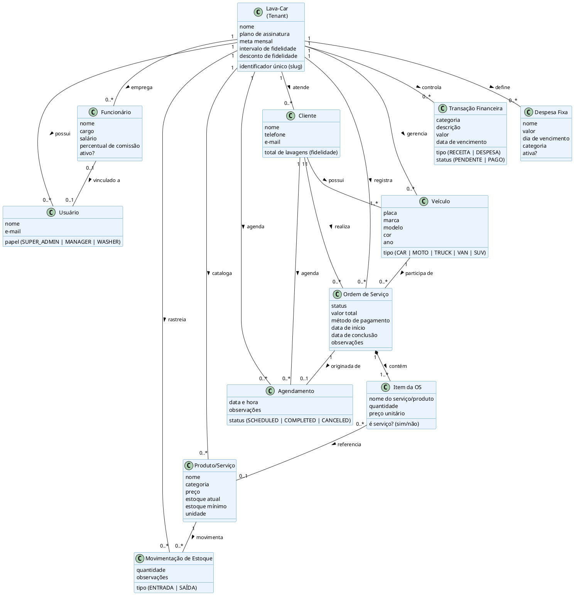

---

## 5. Diagrama de Classes

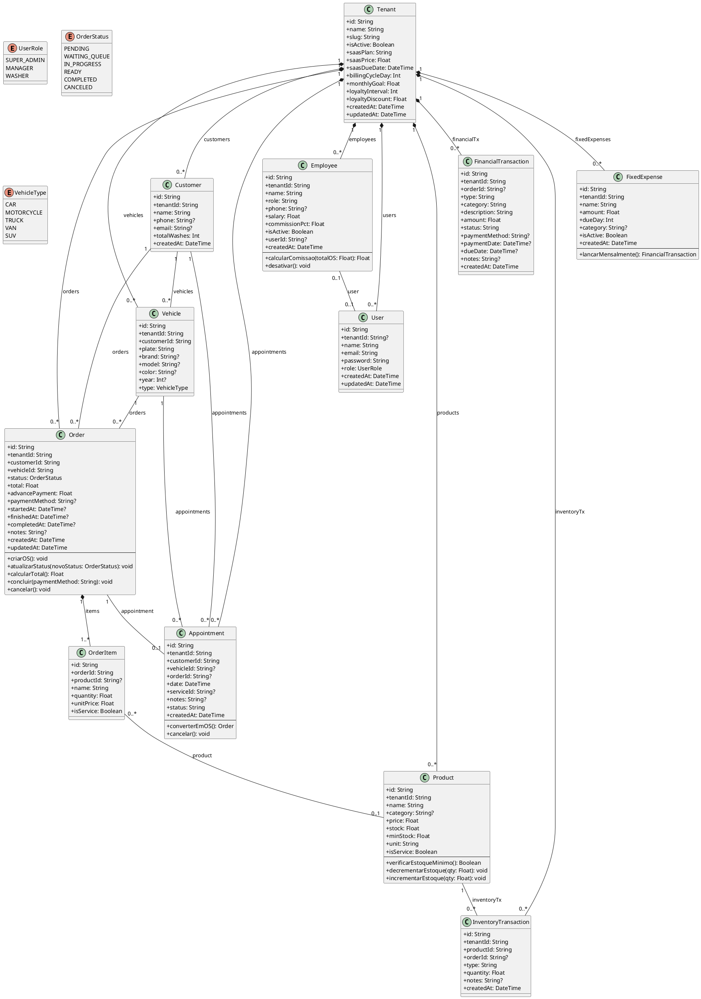

---

## 6. Diagrama de Objetos

O diagrama de objetos apresenta uma instância concreta do sistema, representando um cenário real de atendimento: o cliente **João Silva** deixou seu veículo **Honda Civic (ABC-1234)** para uma lavagem completa com cera. Este snapshot representa o momento em que a OS está com status IN_PROGRESS.

> **Justificativa da escolha das classes:** As classes Order, Customer, Vehicle, OrderItem e Product foram selecionadas por constituírem o núcleo transacional do sistema — são as entidades que trocam estado com maior frequência durante a operação diária. O Tenant foi incluído para ilustrar o isolamento multi-tenant. Employee e FinancialTransaction foram omitidos pois ainda não há valores definitivos neste estado (a OS está em andamento, não concluída).

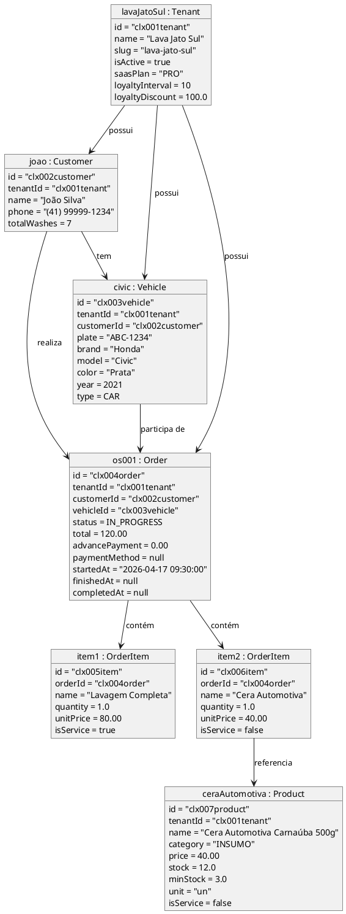

---

# RA3 — Diagramas Comportamentais

## 7. Diagramas de Sequência

### 7.1 DS-01 — Autenticação e Acesso ao Dashboard

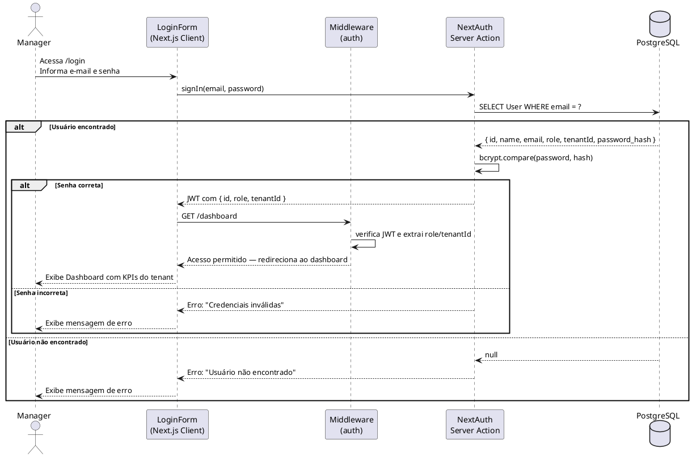

---

### 7.2 DS-02 — Criar e Concluir Ordem de Serviço

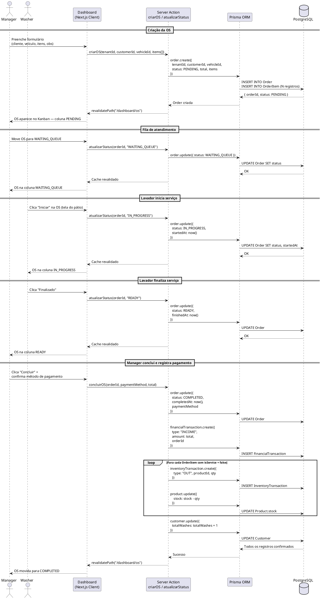

---

### 7.3 DS-03 — Criar Agendamento e Converter em OS

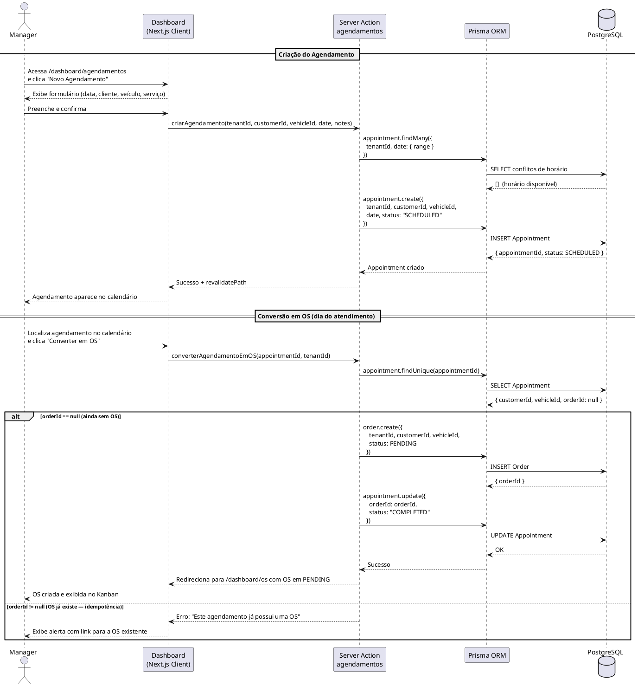

---

### 7.4 DS-04 — Baixa Automática de Estoque ao Concluir OS

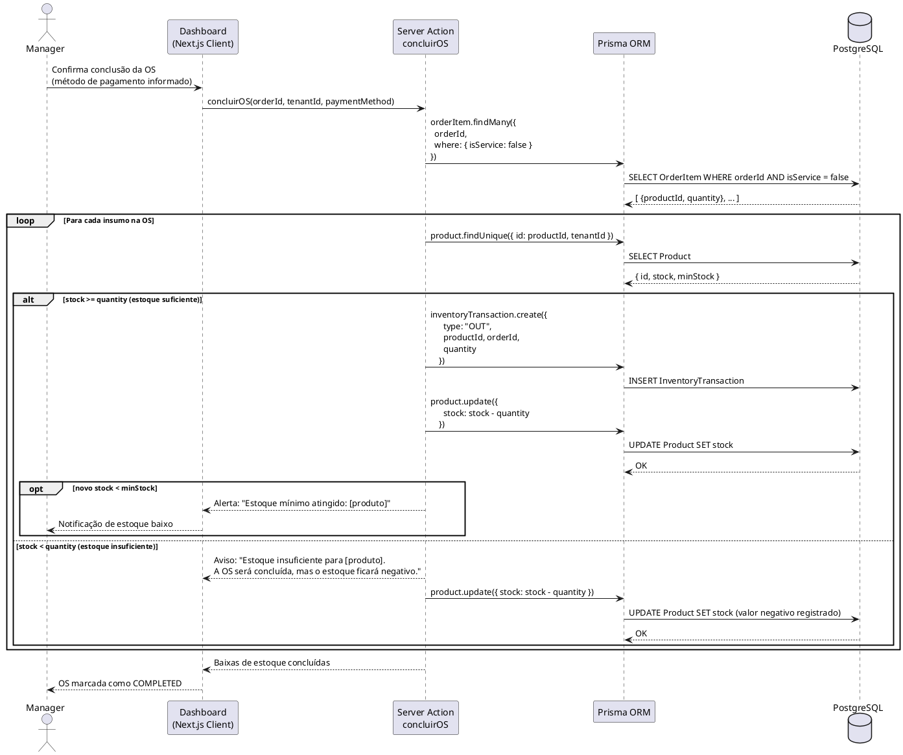

---

### 7.5 DS-05 — Visualização do Relatório Financeiro (DRE)

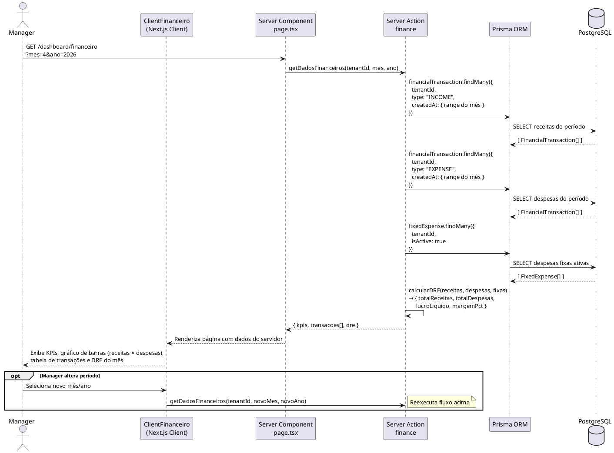

---

## 8. Diagramas de Atividades

### 8.1 DA-01 — Fluxo Completo de Atendimento (Ciclo da OS)

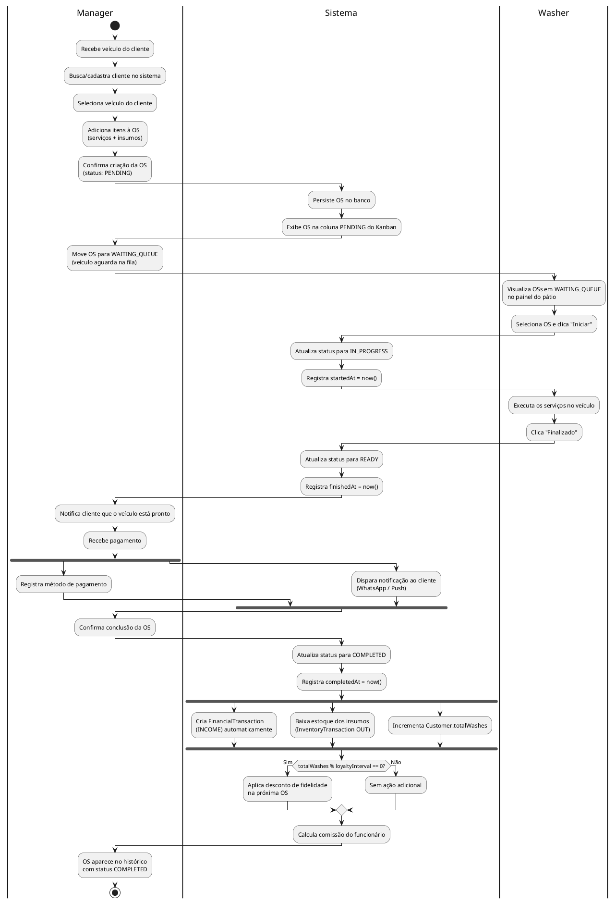

---

### 8.2 DA-02 — Fluxo de Agendamento

```plantuml
@startuml DA02_Agendamento

start

:Manager cria agendamento\n(data, cliente, veículo, serviço);

|Sistema|
:Verifica disponibilidade do horário;

if (Horário disponível?) then (Sim)
  :Salva Appointment\nstatus: SCHEDULED;

  fork
    :Exibe no calendário do sistema;
  fork again
    :Envia lembrete ao cliente\n(futuro — RF09);
  end fork

  :Data do agendamento chega;

  |Manager|
  if (Cliente comparece?) then (Sim)
    :Clica "Converter em OS";

    |Sistema|
    :Verifica se já existe OS\nvinculada ao agendamento;

    if (orderId == null?) then (Sim — primeiro acesso)
      :Cria Order com dados\ndo agendamento (PENDING);
      :Vincula orderId ao Appointment;
      :Atualiza Appointment → COMPLETED;
      :Redireciona para Kanban;
    else (Não — OS já existe)
      :Bloqueia criação duplicada\n(idempotência);
      :Exibe link para OS existente;
    endif

  else (Não comparece)
    |Manager|
    :Cancela agendamento;
    |Sistema|
    :Atualiza Appointment → CANCELED;
  endif

else (Horário ocupado)
  :Exibe aviso de conflito\nde horário;
  :Retorna ao formulário\npara nova seleção;
endif

stop

@enduml
```

---

### 8.3 DA-03 — Cálculo de Fidelidade e Desconto

```plantuml
@startuml DA03_Fidelidade

start

:OS é concluída\n(status → COMPLETED);

|Sistema|
:Incrementa Customer.totalWashes\n(totalWashes + 1);

:Consulta configuração do tenant:\n- loyaltyInterval (N lavagens)\n- loyaltyDiscount (% desconto);

if (totalWashes % loyaltyInterval == 0?) then (Sim)
  :Cliente atingiu marco de fidelidade;

  fork
    :Registra desconto disponível\npara próxima OS;
  fork again
    :Notifica cliente sobre\nbônus conquistado\n(RF09 — futuro);
  end fork

  if (loyaltyDiscount == 100?) then (Lavagem grátis)
    :Próxima OS com\nvalor total = R$ 0,00;
  else (Desconto percentual)
    :Próxima OS com\ndesconto de {loyaltyDiscount}% no total;
  endif

else (Não)
  :Nenhuma ação de fidelidade;
  :Exibe progresso:\n"{totalWashes} de {loyaltyInterval} lavagens";
endif

stop

@enduml
```

---

### 8.4 DA-04 — Lançamento de Despesa Fixa Mensal

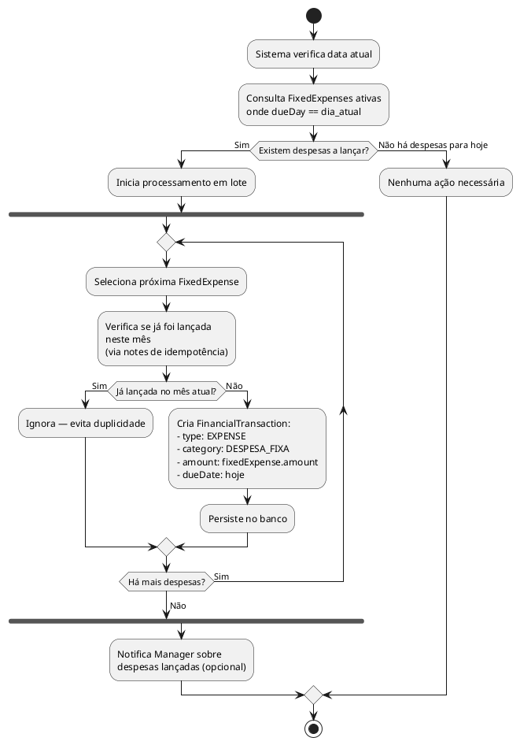

---

## 9. Diagramas de Máquina de Estados

### 9.1 DME-01 — Ciclo de Vida da Ordem de Serviço

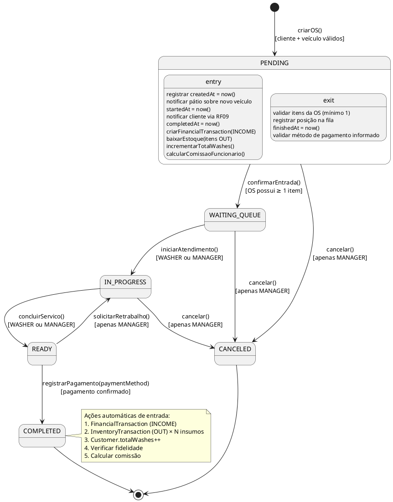

---

### 9.2 DME-02 — Ciclo de Vida do Agendamento

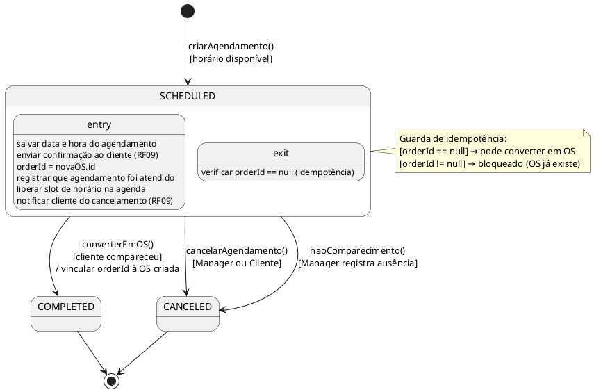

---

# Protótipo

## Diagrama de Navegação de Telas

O WashControl é um sistema web implementado com Next.js 15 (App Router). As telas foram desenvolvidas e funcionais, servindo como protótipo de alta fidelidade.

```plantuml
@startuml NavegacaoTelas

state "/login" as Login {
  : Formulário de e-mail e senha
}

state "/dashboard" as Dashboard {
  : KPIs (receita, OSs, meta mensal)
  : Gráfico receitas vs despesas
  : OSs recentes
}

state "/dashboard/os" as OS {
  : Board Kanban (PENDING | WAITING_QUEUE\n| IN_PROGRESS | READY | COMPLETED)
  : Modal "Nova OS"
  : Modal "Concluir OS"
}

state "/dashboard/patio" as Patio {
  : Cards de veículos em atendimento
  : Botões Iniciar / Finalizar (Washer)
}

state "/dashboard/clientes" as Clientes {
  : Listagem de clientes
  : Cadastro/edição de cliente
  : Veículos vinculados
  : Histórico de OSs
}

state "/dashboard/agendamentos" as Agendamentos {
  : Calendário de agendamentos
  : Formulário novo agendamento
  : Botão "Converter em OS"
}

state "/dashboard/financeiro" as Financeiro {
  : DRE mensal
  : Fluxo de caixa
  : Tabela de transações
  : Lançamento manual de despesa
}

state "/dashboard/insumos" as Insumos {
  : Catálogo de produtos/insumos
  : Controle de estoque
  : Histórico de movimentações
}

state "/dashboard/equipe" as Equipe {
  : Listagem de funcionários
  : Cadastro/edição
  : Relatório de comissões
}

state "/dashboard/lavacarros" as Lavacarros {
  : Catálogo de serviços
  : Tabela de preços
}

state "/dashboard/configuracoes" as Config {
  : Dados do tenant
  : Configuração de fidelidade
  : Plano SaaS atual
}

[*] --> Login
Login --> Dashboard : autenticação bem-sucedida

Dashboard --> OS
Dashboard --> Patio
Dashboard --> Clientes
Dashboard --> Agendamentos
Dashboard --> Financeiro
Dashboard --> Insumos
Dashboard --> Equipe
Dashboard --> Lavacarros
Dashboard --> Config

OS --> Agendamentos : converter agendamento
Agendamentos --> OS : OS criada
OS --> Financeiro : OS concluída → lança receita
OS --> Insumos : OS concluída → baixa estoque

@enduml
```

## Telas Principais

O sistema possui protótipo de alta fidelidade implementado e funcional. As principais telas e seus objetivos:

| Tela | Descrição | Ator Principal |
|---|---|---|
| **Login** | Autenticação com e-mail e senha, redirecionamento por papel | Manager / Washer / SuperAdmin |
| **Dashboard** | KPIs: receita do dia/mês, OSs em andamento, meta mensal, gráfico receitas × despesas | Manager |
| **OS — Kanban** | Board com 5 colunas de status, drag-and-drop de cards, modal de criação e conclusão de OS | Manager |
| **Pátio** | Visão simplificada dos veículos em atendimento, botões de ação para o Washer | Washer |
| **Clientes** | CRUD de clientes, veículos vinculados, histórico de lavagens, programa de fidelidade | Manager |
| **Agendamentos** | Calendário mensal, formulário de novo agendamento, conversão em OS | Manager |
| **Financeiro** | DRE mensal, fluxo de caixa, listagem de transações com filtros | Manager |
| **Insumos** | Catálogo de produtos com estoque, alertas de mínimo, histórico de movimentações | Manager |
| **Equipe** | Cadastro de funcionários, vinculação com usuário do sistema, comissões | Manager |
| **Configurações** | Dados do tenant, configuração de fidelidade, plano SaaS | Manager |

---

# Criatividade

Os itens abaixo foram identificados pela equipe como contribuições criativas (inovação) — itens não solicitados explicitamente pelo enunciado que tornam o trabalho superior:

## Criatividade no Projeto (Documento)

1. **Sistema real implementado como protótipo de alta fidelidade:** Em vez de um protótipo estático no Figma, o WashControl foi desenvolvido como uma aplicação funcional em Next.js 15, com banco de dados real (PostgreSQL), autenticação e Server Actions — tornando o protótipo interativo e demonstrável.

2. **Programa de fidelidade parametrizável:** A modelagem incluiu campos `loyaltyInterval` e `loyaltyDiscount` no `Tenant`, permitindo que cada lava-car configure seu próprio programa de fidelidade (a cada N lavagens, X% de desconto) — um diferencial competitivo não previsto nos requisitos originais.

3. **Técnicas de Elicitação documentadas com rastreabilidade:** Cada técnica (Entrevista, Observação, Questionário, Brainstorming, JAD) foi documentada com stakeholder-alvo, roteiro aplicado, limitações encontradas e mapeamento direto para os RFs/RNFs resultantes — vai além da simples listagem de técnicas.

4. **Diagrama de Objetos com cenário real e justificativa:** O diagrama de objetos apresenta uma instância concreta de atendimento em andamento, com valores reais e justificativa da escolha das classes representadas.

5. **Idempotência modelada explicitamente:** A restrição `Appointment.orderId @unique` foi especificada como regra de negócio (RN-03) e representada em fluxos alternativos/exceções das especificações de caso de uso e no diagrama de estados do Appointment.

## Criatividade no Produto

6. **Arquitetura multi-tenant real:** O isolamento de dados entre tenants é garantido em nível de banco de dados pelo campo `tenantId` obrigatório em todas as tabelas — não é um isolamento lógico por aplicação, mas estrutural.

7. **Automações em cascata ao concluir OS:** Ao marcar uma OS como COMPLETED, 5 ações são executadas automaticamente em uma única transação: receita financeira, baixa de estoque, contagem de fidelidade, cálculo de comissão e verificação de desconto — modelado e implementado.

8. **Módulo de faturamento SaaS (B2B):** Além do sistema para o lava-car, existe um módulo de faturamento para o Super Admin gerenciar os planos e cobranças dos tenants — tornando o WashControl um produto SaaS completo (produto + plataforma).

---

# Responsabilidades

Todos os integrantes da equipe devem assinar e datar o documento de Análise e Projeto do Sistema Computacional.

| Integrante | RA | Assinatura | Data |
|---|---|---|---|
| Leonardo dos Santos Marques | — | _________________________ | 17/04/2026 |

---

*Documento elaborado para a disciplina de Modelagem de Sistemas Computacionais — BCC/PUCPR*
*Professora: Patricia Rucker de Bassi*
*Sistema: WashControl — Sistema SaaS de Gestão para Lava-Cars*
